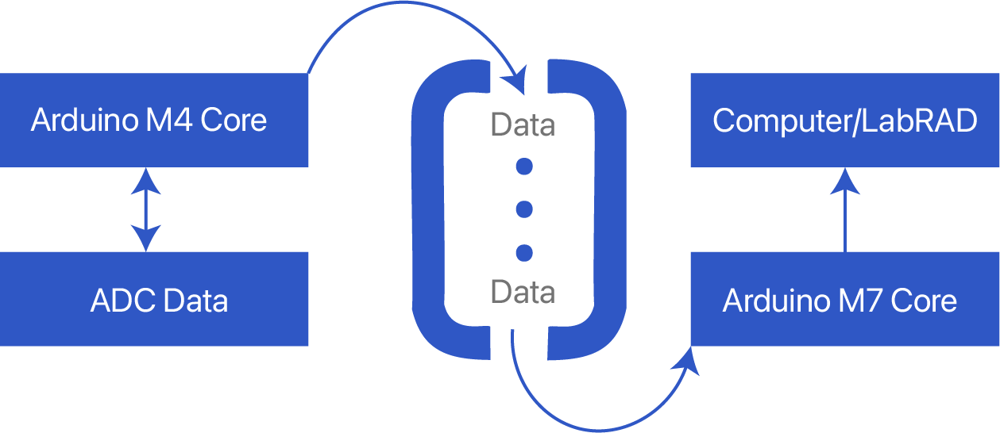

# DAC/ADC Firmware

[](LICENSE)

Firmware for Young Lab AD5791 DACs / AD7734 ADCs. New features include precise timings (<300ns error) for SPI comms, new buffer ramp options, and data acquisition being in-tandem with transmission to LabRAD.

The firmware is designed to be easily extensible, as new peripherals can simply be added with little consideration for how other peripherals are written, as operations are all added independently to a centralized registry.

**If you have any questions**, feel free to email (or slack) [markzakharyan@ucsb.edu](mailto:markzakharyan@ucsb.edu)

<!--
## Table of Contents

- [Installation](#installation)
- [Usage](#usage)
- [License](#license)
-->

## Installation

1. Unzip Firmware_Package.zip (from the releases tab)

2. Make sure you have `dfu-util` installed

  - **Linux (Debian)**: `sudo apt install dfu-util`
  - **MacOS**: `brew install dfu-util`
  - **Windows**:
    - Download [dfu-util](https://dfu-util.sourceforge.net) to your local system, e.g., under `D:\dfu-util`.
    - Rename it to `dfu-util.exe`.
    - Append the path of the `dfu-util.exe` to the system environment variable PATH.

3. Run `pip install -r requirements.txt`

4. Plug in Arduino Giga

5. Run `python3 upload_firmware.py`

You can also build/upload from source:

This firmware is comprised of two individual PlatformIO projects, one for the M7 core and the other for the M4. To build and upload to the Arduino Giga, you need to install PlatformIO and separately upload the firmware for both the M7 and M4 processors (found in their respective folders). There is no extra configuration you need to do, as all processor information is contained in each project's platformio.ini file.

## Usage

***Firmware docs are still in progress***

Note for vim users: If you have any issues with linting/LSP with (neo)vim then try running `pio run -t compiledb` in both the m7 and m4 directories.

**New features of this firmware include:**

- **Function Registry / user IO handling completely separate from all peripheral logic**
  - This means you can add/modify peripheral logic without regard for how the firmware processes commands. Simply write your logic and register commands with the Function Registry
- **Precise timings**
  - Framework to trigger events at a specified frequency, with error <300ns. We use this to communicate with the DAC/ADC at very precise intervals in buffer ramps
- **Dual Core**
  - Utilizes both M4 and M7 cores of the Arduino Giga, which allows parallel data collection and transmission to LabRAD, which saves a *substantial* amount of time during long buffer ramps (~25% faster).
- **New native buffer ramp options**
  - DAC-led ramp now allows for precise control over DAC settling time
  - Time series buffer ramp allows for spectral analysis of data after collection with LabRAD
  - Native 2D buffer ramp along any arbitrary axis in DAC voltage phase space
  - Boxcar buffer ramp

### Known Issues

- There are currently no known issues! Please let me know if you find a bug.

### Function Registry

One of the design goals of the new firmware was to make it easily extensible (add new features/peripherals without dealing with spaghetti code). The way we deal with this is by separating user IO and peripherals.

The general idea is:

command received (UserIOHandler) --> command looked up in FunctionRegistry --> function defined in relevant file executed with args from command.

To add new commands to a file, you don't have to mess around with user IO, the function registry, or any command-executing stuff, simply add the relevant code in whichever file you like and **make sure the command is added to the FunctionRegistry** like so:

```cpp
#include "FunctionRegistry/FunctionRegistryHelpers.h"

registerMemberFunction(setConversionTime, "CONVERT_TIME");
```

Note: this only works with functions that have a set number of float or float-castable args (ie floats, ints).

The number of arguments the function takes is automatically inferred by `registerMemberFunction`, so you don't have to worry about that, just register the function and you're good to go! In this example, `setConversionTime` is a function that accepts 2 float arguments and `CONVERT_TIME` is the command that calls `setConversionTime`. So, if I run the command `CONVERT_TIME,0,80`, I am calling `setConversionTime(0.0,80.0)`. In this case, the floats are automatically casted as ints since the function I'm calling only accepts ints.

For functions with an arbitrary number of args, you can call:

```cpp
#include "FunctionRegistry/FunctionRegistryHelpers.h"

registerMemberFunctionVector(timeSeriesBufferRampWrapper, "TIME_SERIES_BUFFER_RAMP");
```

This will pass one `std::vector<float>` which contains all args, which you should parse yourself.

### Precise Timings (Hardware Timer)

Precise timings were achieved by using separate hardware timers for the DAC and ADC and configuring the Arduino Giga to trigger an interrupt service routine (ISR) when a timer's register exceeds a certain value. All timing-related things are handled in `TimingUtil.h`, which mostly contains register configurations to setup the hardware timers properly. TIM1 is used for the DAC and TIM8 is used for the ADC.

After setting up a timer using TimingUtil (for example, by calling `setupTimersTimeSeries(dac_period_us, adc_period_us)`), `TimingUtil::dacFlag` and `TimingUtil::adcFlag` are set to true constantly after a given period. What's expected is a loop to constantly check if one of these flags is `true`, execute something, and set that flag to false.

**Important:** None of the timers in TimingUtil automatically stop, and the function that calls a TimingUtil function must recognize when the timers have triggered enough times and call `TimingUtil.disableDacInterrupt()` and/or `TimingUtil.disableAdcInterrupt()`

The two modes we have for precise timings are Time Series, and DAC-Led. Time Series simply triggers both the `dacFlag` and `adcFlag` at their respective intervals, starting at the same time. DAC-Led triggers both the `dacFlag` and `adcFlag` at the same frequency (`dac_interval_us`), with a phase difference between them (`dac_settling_time_us`)

### SPI Comms

#### Simultaneity

When two events occur at the same time, the following behavior occurs:

- **No matter what, DAC SPI gets sent before all ADC SPIs.**
- *Note: if you travel faster than the speed of light, you could observe the opposite*

- **For fully upgraded 16x16 DAC/ADC Hardware:**
- ADCs are read in channel-ascending order, with simultaneous measurements taken on channels on separate cards with the same index (of active channels).
- For example, if channels 0 and 3 are converting then channel 0 will convert before channel 3
- If, instead, channels 0, 1, 5, and 6 were active then channels 0 and 5 would convert simultaneously and channels 1 and 6 would convert simultaneously. Even though these channels aren't "vertical" on the ADC panel, they will still convert simultaneously since they are the only active channels and will be treated as "vertical".
- **For drop-in Giga+Firmware upgraded DAC/ADC Hardware:**
- ADCs convert in ascending order by index, with no simultaneity *guaranteed*
- Simultaneity can, in principle, occur with the same schema as described for the fully upgraded DAC/ADC hardware if the conversion time of the ADCs is longer than the SPI clock speed of the ADC.
- However, exactly when the ADCs convert is still *undefined behavior* and simultaneity is not guaranteed.

### Dual Core Comms

This firmware utilizes both the M4 and M7 cores of the Arduino Giga R1. By default, the M7 core is booted and the M4 is initialized *on the M7*.

The purpose of using a dual-core approach is to completely separate (very slow) Serial communications and peripheral SPI communications. Since the M4 core does not have access to USB/Serial, the M7 core is used for Serial comms and the M4 is used for peripheral SPI comms. We do this because Serial is ISR-blocking and prevents SPI from properly being executed at the precise intervals that we want. So, we need dual-core.

If you Google the docs for how to implement dual-core communications between the M4 and M7 cores, it tells you to use RPC. **We do not do this!** RPC is slow for our purposes and completely screws up our precise timings for the same reason why Serial messes them up. Instead, we manually initialize the M4 core ourselves (instead of with RPC) and use a circular shared memory buffer that both the M4 and M7 have access to. We initialize the M4 core ourselves (instead of with `RPC.begin()`).

We have comms pipelines for char arrays (cstrings), float arrays, and `VoltagePacket` arrays (defined below). By "comm pipeline", I mean a one-direction transfer of data of a particular type. For instance, we have *separate* circular buffers for floats going from M4 to M7 and floats going from M7 to M4. Each circular buffer works like this:


This is an example for how ADC voltages are collected and transmitted to LabRAD mid ramp. There's another identical buffer for data going the other direction --from the M7 to the M4.

A `VoltagePacket` is simply a float that is transmitted to LabRAD over serial as four bytes, most significant bit first. This is significantly faster than printing to serial the voltage float converted to a char array, which is why we use this in buffer ramps. Technically, this is one extra byte than in the old firmware, which sent raw DAC data and had LabRAD calculate the voltage. Since we have async data transfer now, we don't need to worry about this extra byte --the added simplicity is worth it.

### Buffer Ramps

#### Boxcar Buffer Ramp Notes

On old hardware, boxcar ramps may have ADCs convert before DAC updates, then read converted data after DAC update, making it appear as if data is after DAC conversion when it may not be

- Workaround: the function allows you to add ADC conversion skips. Adding one skip guarantees that all collected data is within the current DAC period, but data is slightly delayed after DAC update.

## License

This project is licensed under the [MIT License](LICENSE).
